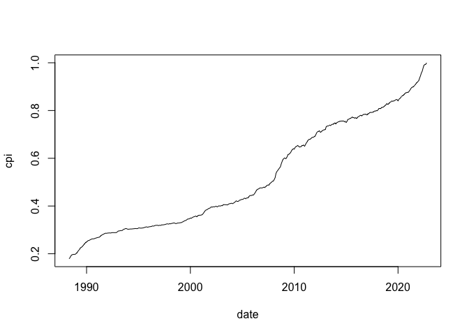
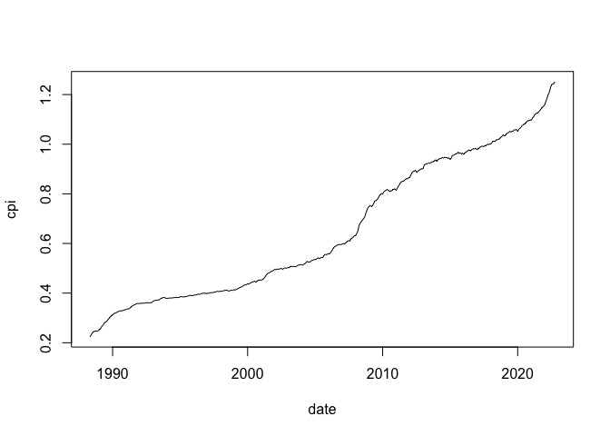
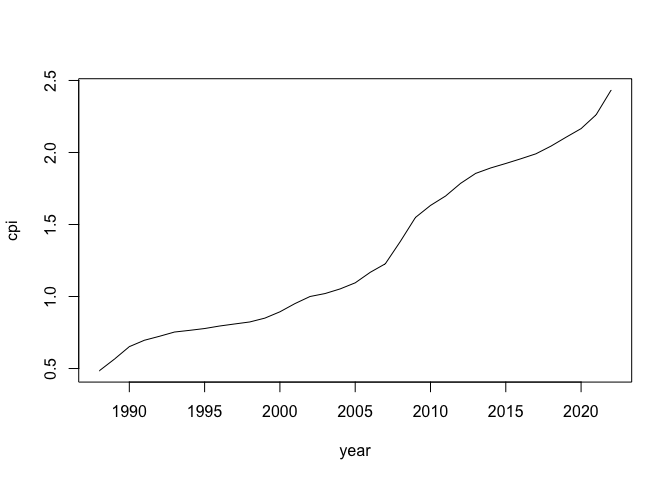

<!-- README.md is generated from README.Rmd. Please edit that file -->

# visitalaneysluverds

<!-- badges: start -->
<!-- badges: end -->

The package provides an easy way to fetch the CPI from Statistics
Iceland.

## Installation

You can install the development version of visitalaneysluverds from
[GitHub](https://github.com/) with:

``` r
# install.packages("devtools")
devtools::install_github("bgautijonsson/visitalaneysluverds")
```

## Example

### CPI table

#### Monthly CPI

``` r
library(visitalaneysluverds)
#> Downloading CPI data from Statistics Iceland and making available to internal functions. This happens once per session.
d <- vnv()

d
#> # A tibble: 414 × 2
#>    date         cpi
#>    <date>     <dbl>
#>  1 1988-05-01 0.179
#>  2 1988-06-01 0.185
#>  3 1988-07-01 0.191
#>  4 1988-08-01 0.195
#>  5 1988-09-01 0.197
#>  6 1988-10-01 0.197
#>  7 1988-11-01 0.198
#>  8 1988-12-01 0.198
#>  9 1989-01-01 0.201
#> 10 1989-02-01 0.204
#> # … with 404 more rows
```

``` r
plot(cpi ~ date, data = d, type = "l")
```



You can input a date on which the CPI should be equal to 1. The date has
to be between 1988-05-01 and the month preceding the current month. If
no date is input the CPI will be equal to 1 on 1988-05-01.

``` r
d <- vnv(date_unity = as.Date("2018-01-1"))
plot(cpi ~ date, data = d, type = "l")
```



#### Yearly CPI

``` r
d <- vnv_yearly()

d
#> # A tibble: 35 × 2
#>     year   cpi
#>    <int> <dbl>
#>  1  1988 0.199
#>  2  1989 0.232
#>  3  1990 0.268
#>  4  1991 0.286
#>  5  1992 0.297
#>  6  1993 0.309
#>  7  1994 0.314
#>  8  1995 0.319
#>  9  1996 0.327
#> 10  1997 0.333
#> # … with 25 more rows
```

``` r
plot(cpi ~ year, data = d, type = "l")
```


You can input a date on which the CPI should be equal to 1. The date has
to be between 1988-05-01 and the month preceding the current month. If
no date is input the CPI will be equal to 1 on 1988-05-01.

``` r
d <- vnv_yearly(year_unity = 2002)
plot(cpi ~ year, data = d, type = "l")
```



### Performing CPI adjustments

#### Monthly prices

The package offers use of the function `vnv_convert()` to convert prices
to a common CPI standard.

``` r
price <- c(1, 2, 3, 4, 5)
date <- as.Date(c("2020-01-01", "2019-01-01", "2018-01-01", "2017-01-01", "2016-01-01"))
d <- data.frame(
    date = date,
    price = price
)

d$price_2020_01_01 <- vnv_convert(d$price, d$date, date_unity = as.Date("2020-01-01"))

d
#>         date price price_2020_01_01
#> 1 2020-01-01     1         1.000000
#> 2 2019-01-01     2         2.033766
#> 3 2018-01-01     3         3.154432
#> 4 2017-01-01     4         4.305155
#> 5 2016-01-01     5         5.484473
```

The function `vnv_convert()` works because the package downloads CPI
data from Statistics Iceland once per session and makes it available to
internal functions, allowing the user to use the most recent CPI data to
compare prices if needed.

#### Yearly prices

The `vnv_convert()` function detects whether the `obs_date` and
`date_unity` variables have the class `Date` or `integer` and
automatically performs the right type of CPI adjustmeny (monthly/yearly)
for your data.

``` r
price <- c(1, 2, 3, 4, 5)
year <- c(2011, 2012, 2013, 2014, 2015)
d <- data.frame(
    year = year,
    price = price
)

d$price_2020 <- vnv_convert(d$price, d$year, date_unity = 2020)

d
#>   year price price_2020
#> 1 2011     1   1.275724
#> 2 2012     2   2.425638
#> 3 2013     3   3.502908
#> 4 2014     4   4.576924
#> 5 2015     5   5.629149
```
